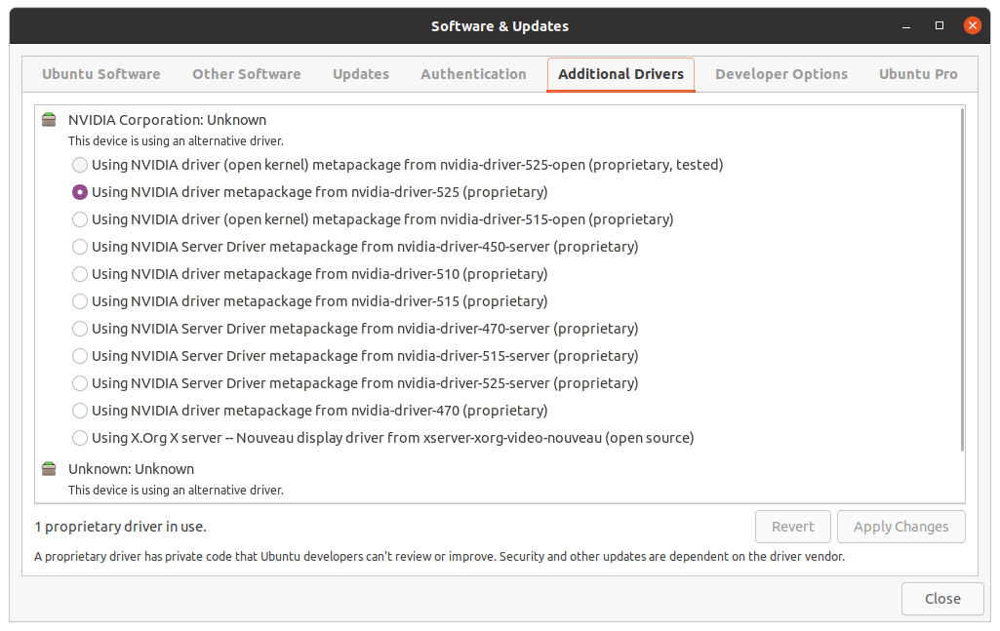

# Stuck at boot screen (showing "Ubuntu" and loading icon already)



```
Guess: Some issue with the nidia driver being used

Solution: Modify Linux kernel parameter (add `nomodeset`) and reboot. Cre: [this tutorial](https://itsfoss.com/fix-ubuntu-freezing/)
```

# Unstable health, Ubuntu 20.04

Symptoms:
- External display sometimes detected sometimes not; Configuring orientation does not always work

- Black screen with this line repeatedly printed

```
... Error: GPU:0: Error while waiting for GPU progress: 0x0000c67d ...
```

  - This Nvidia staff gave a not-so-pleasant [comment](https://forums.developer.nvidia.com/t/geforce-rtx-3060-error-gpu-error-while-waiting-for-gpu-progress-0x0000c67d/223489/4)

  - Running `nvidia-bug-report.sh` results in the file `nvidia-bug-report.log` that says the same thing his unpleasant comment

    - > _Mar 21 20:18:56 pc kernel: [   65.315783] NVRM: Xid (PCI:0000:01:00): 79, pid='<unknown>', name=<unknown>, GPU has fallen off the bus.
  Mar 21 20:18:56 pc kernel: [   65.315792] NVRM: GPU 0000:01:00.0: GPU has fallen off the bus._

  - Grabbing this clue, [staff armrit](https://forums.developer.nvidia.com/t/gpu-has-fallen-off-the-bus/217357/4) supposed it is due to BIOS, power supply, or thermal issue
    - Checking for these 3 things needed!

    - Additionally, this guy solves the problem by changing slot (!?) [link](https://bbs.archlinux.org/viewtopic.php?id=267855)
      - > _Either the GPU draws more than 25W or the PCIe x1 doesn't provide the full 25W - either way there was no margin for error…_

  - Grab "NVIDIA Corporation Device 1f95 (rev a1)", which is part of the output of `lspci -k`. Now try these things by order! (we're close!):
    - https://askubuntu.com/a/1423504
    - https://forums.developer.nvidia.com/t/geforce-gtx-1650-ti-and-linux-mint-19-3/124667/20

- Encountered the first recurrance of this issue

```
$ nvidia-smi
Unable to determine the device handle for GPU 0000:01:00.0: Unknown Error
```

after everything runs smoothly by booting with kernel `5.14.0-1059-oem` selected

  - This guy has same condition: https://forums.developer.nvidia.com/t/unable-to-determine-the-device-handle-for-gpu-xxxxxxxx-unknown-error/230277/5